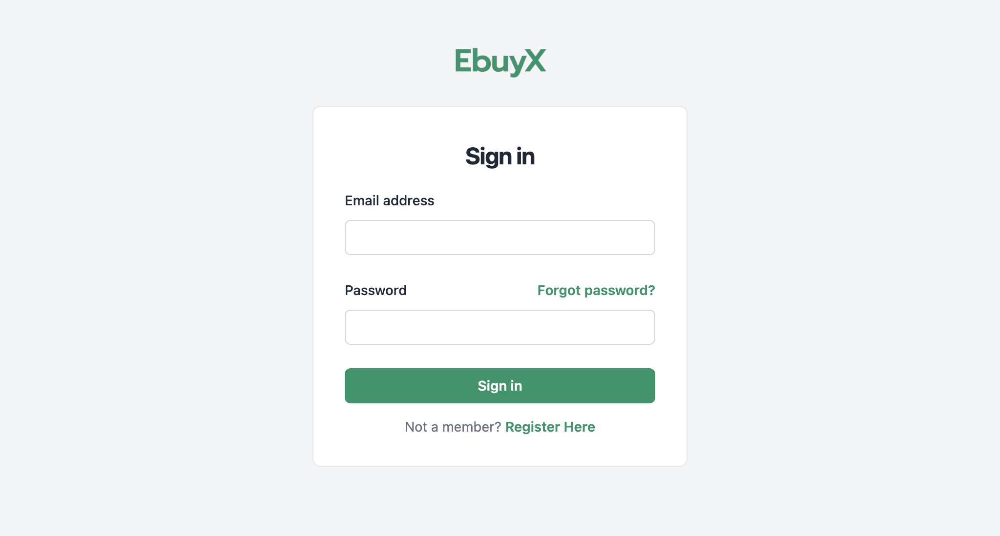
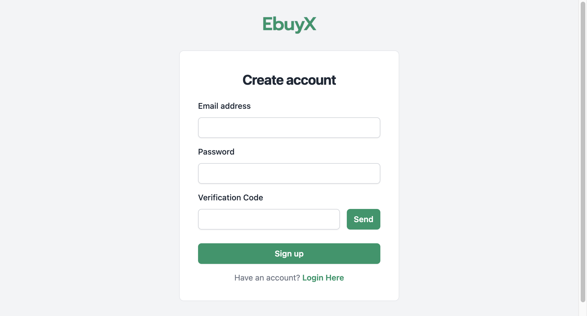
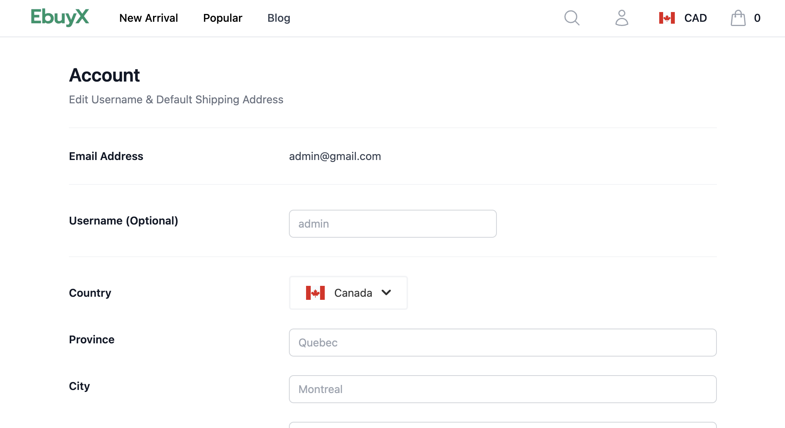
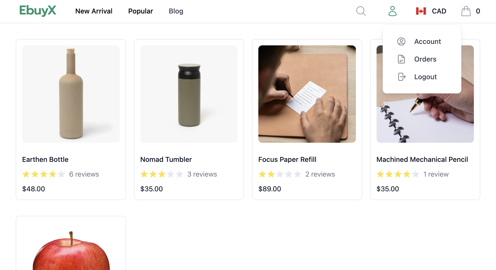
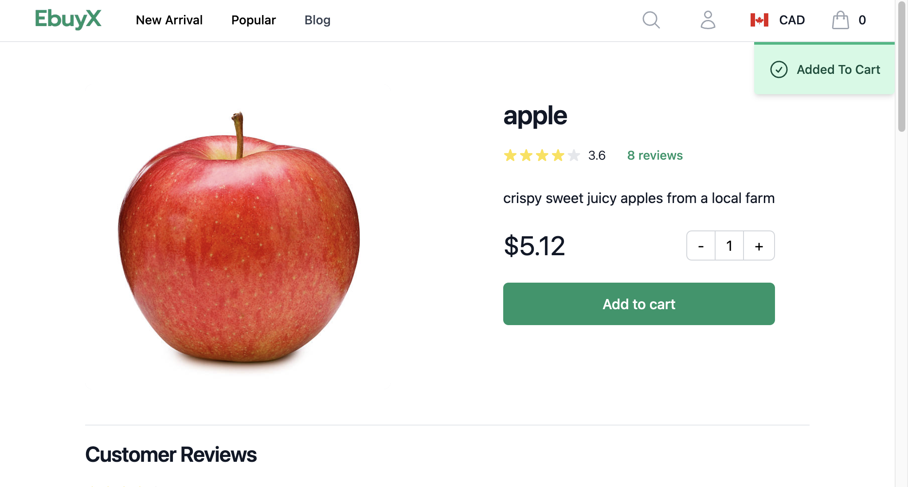
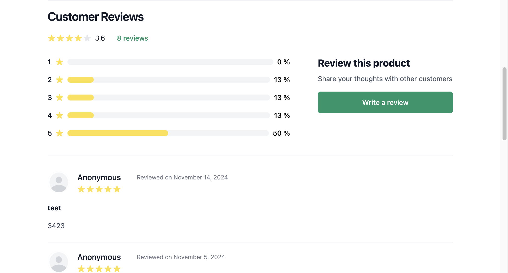
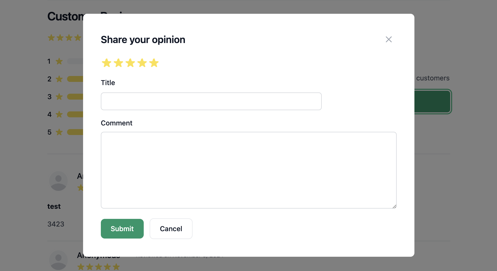
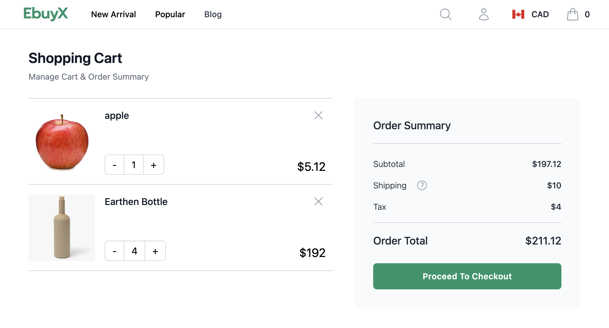
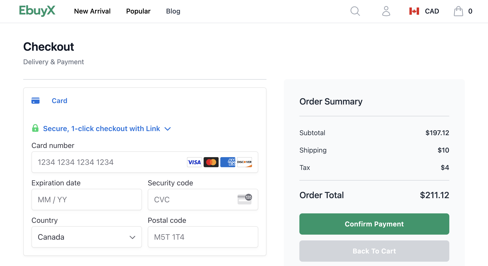
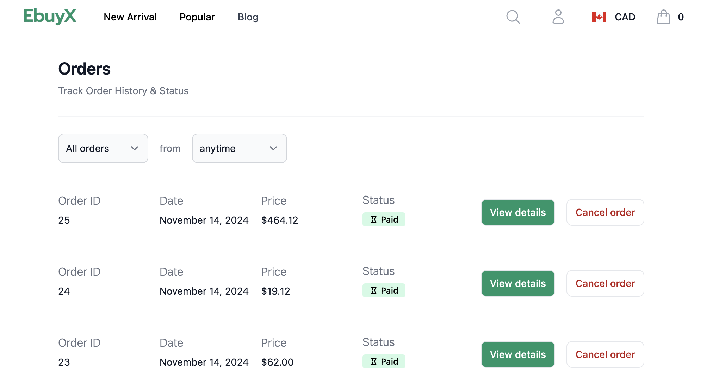

<!-- PROJECT LOGO -->
 

  

  
 
    Full-stack ecommerce web app built from scrtach with  
    React, Tailwind CSS, Express.js, PostgresSQL, Docker
     
     
  <a href="https://ebuyx.onrender.com">
    Project deployed on render >>
  </a>
  

## Project Highlight
- fully responsive mobile/desktop layout powered by TailwindCSS
- secure JWT authentication and OTP verification
- secure checkout with StripeAPI integration
- organized project structure by features
- automated CI/CD pipeline and Docker containerization

## Features
- User
  - register (with OTP verification)
  - login & logout (session-based authentication)
  - profile (edit and save username and shipping address)

  
   
   

- Product
  - list of all products
  - lists filtered by "most popular" and "newest arrival"
  - product detail - add to cart, customer reviews
  - search a product
 

  
   
   
   

- Cart
  - view cart items, view total
  - secured checkout (Stripe API)
 

  
   

- Order
  - order history and status
  - cancel pending orders
  - filter by order date and/or status

  

## Fix Log
- Dec 14 2024: Session not persisted after logging in. Works fine locally.
  - issue: on.render.com is public domain which does not support cookies
  - solution: migrated authentication method from express-session to jwt

## Side Notes
- free render databases expire in a month. Restore data by `{DATABASE_PSQL_COMMAND} < database/ebuyx_backup.sql`
